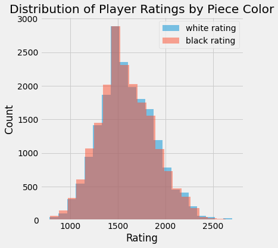
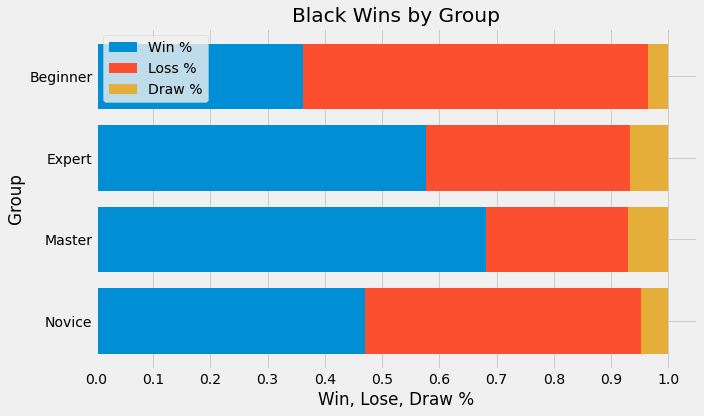

## I'll Be Sicilian You Later!

    

## Table of Contents
1. Overview
2. Data Set
3. Questions
4. Cleaning
5. Visualization
6. Testing
7. Conclusion

## Overview

Chess is a two-player strategy board game played on a checkered board with 64 squares in an 8x8 square grid. The game is believed to have originated in India in the 6th century. Since then, chess has evolved into both a sport and a casual game enjoyed by millions of people worldwide. 

Each player begins a game of chess with 16 pieces: one king, one queen, two rooks, two knights, two bishops, and eight pawns. Each piece moves differently, with the most powerful being the queen and the least powerful the pawn. Play involves no hidden information. The objective is to checkmate the opponent's king by placing it under an inescapable threat of capture. 

Chess strategy consists of setting and achieving long-term positioning advantages during the game, while chess tactics concentrate on immediate maneuvering. 

A game of chess is normally divided into three phases: the opening, typically the first 10 moves, the middlegame, and the endgame. 

## Data Set

The analysis is based on the Chess Game Dataset (Lichess), which includes data from nearly 20,000 games from a selection of users on Lichess.org. General information about the dataset can be found below:

General Info:\
Game ID: object\
Rated (T/F): bool\
Start Time: float64\
End Time: float64\
Number of Turns: int64\
Game Status: object\
Winner: object\
Time Increment: object\
White Player ID: object\
White Player Rating: int64\
Black Player ID: object\
Black Player Rating: int64\
All Moves in Standard Chess Notation: object\
Opening Eco (Code for any given opening): object\
Opening Name: object\
Opening Ply (Number of moves in opening phase): int64\

### Cleaning
Most of the columns in the dataset are categorical. I loaded the file (csv format) into a pandas dataframe and performed the following cleaning procedures. A link to my python code can be found HERE.

1. Game IDs: dropped duplicate values
2. All Moves in Standard Chess Notation: transformed values from a string into a list
3. Player Rating: created a simplified ranking scale for both White and Black players.
4. Opening Name: created a simplified opening name structure by dropping opening name variations.
5. Winner: created numerical columns to categorize outcome by white, black, or draw.
6. Start Time: created new date column in datetime format

## Questions

As an avid chess player, my goals were to perform EDA, calculate the probability of success after each move, and recommend moves based on the outcomes of similar games.

I quickly realized that I needed to simplify my goals and focused my analysis on answering more basic questions, such as: which opening is most common and is the probability of winning affected by player ranking and piece color.

## Visualization

The dataset included datetime information, which is useful to visualize how the game of chess has changed over time. The graph below illustrates how the number of moves per opening has increased from 2013 to 2017. This could be due to the increase in average player rating and also could have an affect on the average number of turns per game.

The graph below illustrates how the number of moves per opening has increased from 2013 to 2017. 

    

The next graph shows the distribution of players by rating category. Overall, the distribution of players between white and black pieces was fairly even. The mean for white players was 1597, whereas the mean for black players was 1590.

    

    

## Part 2

Openings are a very important part of chess strategy. 

    

Chess Masters win more frequently than Experts, Novices, and Beginners. The graph below highlights the top 20 most frequently used openings by this category.

    

    

The Sicilian Defense is a strategy by black that creates an unbalanced game with many attacking scenarios. The graph below illustrates the winning percentage of this opening by ranking group.

    

The Master Group wins more frequently than the others. To test the independence of win ratio by group I performed a two-sided t-test between the average win rates between the Masters group and the Novice group. The mean win ratio for Masters and Novices was 68% and 47%, respectively. 

statistic = 1.579
pvalue = 0.115

To expand this concept more broadly, I compared the winning percentages of the rating groups based on whether they were white or black. 

    

    

These graphs highlight the first mover advantage, since white pieces move first. Each category won as white more often than as black. The difference in win ratio by Beginners, Novices, Experts, and Masters was 4.9%, 4.8%, 0.3%, and 1.0%, respectively.

To test this I performed a two sample approximate test of population proportions. To set this up I looked at the winning games for beginners playing as white and black. My hypothesis was that a beginner wins an equal amount of games as white and black. In other words, Pbw <= Pbb. 